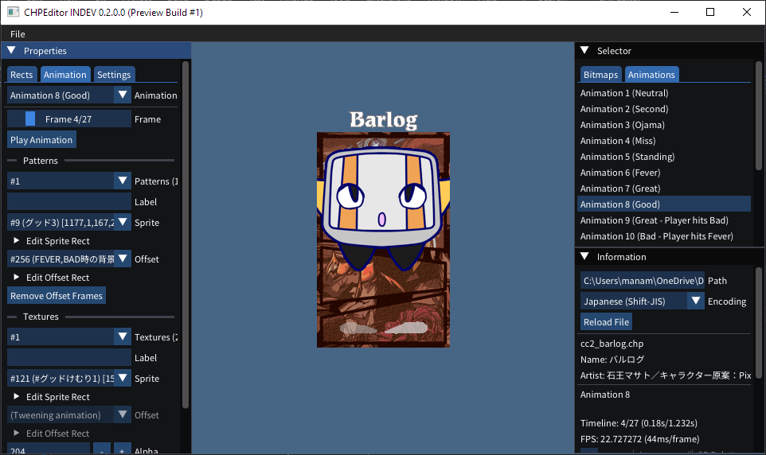

# CHPEditor (0.1.2.2) - [Download Latest Release](https://github.com/DragonRatTiger/CHPEditor/releases/latest)
## An (extremely not finished) application for editing CHP (Pomyu Chara) files

Alongside being a personal project to further study C# & application development, I hope to also create a modern editor for Pomyu Charas.

At this current stage, nothing can actually be edited. The only aspect of this application that works right now is the ability to preview bitmaps & animations. This application does the best that it currently can to preview the animations as-intended by FeelingPomu2nd.
